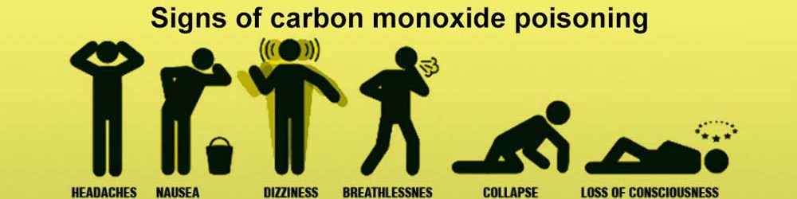
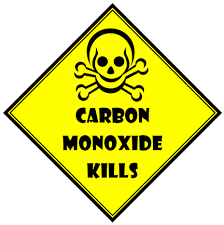
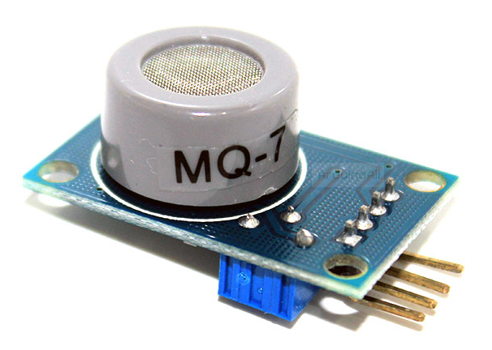

### Carbon Monoxide, significance of detecting it :
****

Carbon monoxide (CO) is a very __dangerous gas which is odorless, colorless, and tasteless__, so it cannot be smelt, seen, or tasted. A person really would have no idea that they are breathing in CO besides the fact that they would start to feel horrible. The most common __symptoms of CO poisoning is headache, nausea, vomiting, dizziness, fatigue, and a feeling of weakness. Neurological signs include confusion, disorientation, visual disturbance, syncope, and seizures.__
Carbon monoxide is produced from the __partial oxidation of carbon-containing compounds__; it forms when there is not enough oxygen to produce carbon dioxide (CO), such as when operating a stove or an internal combustion engine in an enclosed space. So it is really in enclosed spaces with __partial oxidation__ of carbon products that creates the danger of carbon monoxide production in homes or in business environments.
Carbon monoxide poisoning is the most common type of fatal air poisoning in many countries. Being colorless, odorless, and tasteless, it is very hard to detect but __highly toxic.__ Carbon monoxide is absorbed through breathing and enters the bloodstream through gas exchange in the lungs. CO combines with hemoglobin to produce carboxyhemoglobin, which __usurps the space in hemoglobin that normally carries oxygen__, rendering blood inffective to carry and supply oxygen to bodily tissues. This leads to oxygen deprivation, which can be deadly.

>> This gas is as nasty  as it can get. Being virtually transperant to majority of the human sense organs, it manifests itself only by symptoms bordering fatality.

__CO is measured in parts per million (ppm).__ To give you some perspective, the natural atmosphere is composed of 0.1ppm. In there average level in homes is 0.5-5ppm. The level near properly adjusted gas stoves in homes and from modern vehicle exhaust emissions is 5-15ppm. The exhaust from automobilies in Mexico City central area is 100-200ppm.

Having this overview of carbon monoxide gives some background to how it is created and the real severe dangers it can pose. It creates context to just how important it is to be able to detect and measure the amount of CO that may be present in the environment during any given time.

[ Excerpt from here ](http://www.learningaboutelectronics.com/Articles/MQ-7-carbon-monoxide-sensor-circuit-with-arduino.php)

### MQ7 , flying fish sensor module :
****

This module is something you IoT enthusiasts would have come across on most of the e-commerce sites. If you have had any experiences with other gas sensor modules like MQ135, this might come to you as a surpirse. Requirement of of having to heat the sensor with differential power rating is one major change.

The module though is well laid out and the sensor if operated correctly as in the datasheet guidelines , is capable of yeilding pretty stable and reliable values. What is then a bit twisted is the way the ppm reading derived from the voltage readings keeping the log-log characteristics in reference. Here I attempt to explain the method of arriving at the CO concetration. This may help you to design your algorithm running on Pi.

### Schema of things and getting this connected to your RPi
****

### MQ7 characteristics and first glance through the datasheet
***

### Differential heating requirements and priming
****

### Arriving at the sensor resistance from output voltage:
****

### Calculating ppm CO from sensor resistance
****
